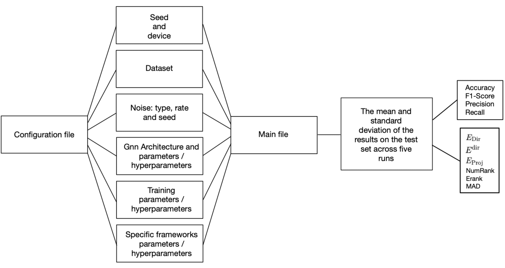
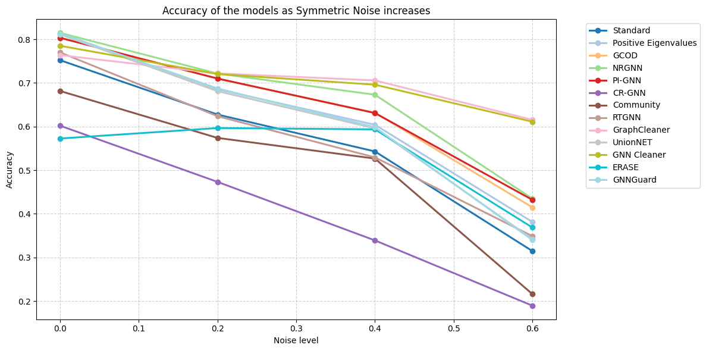
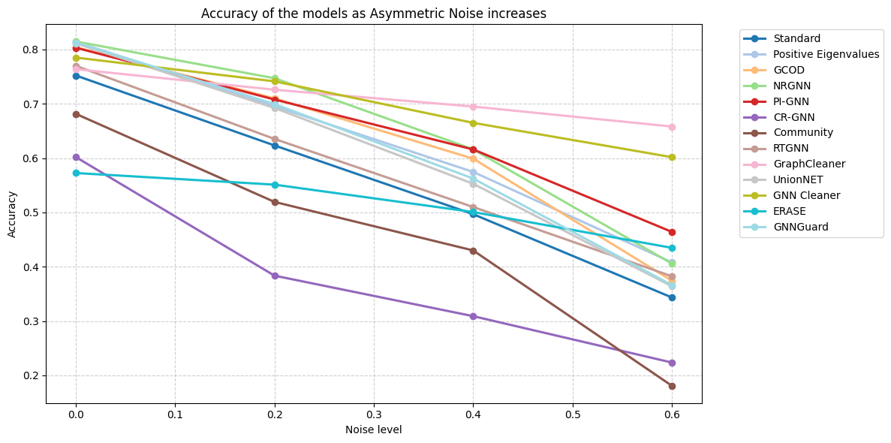
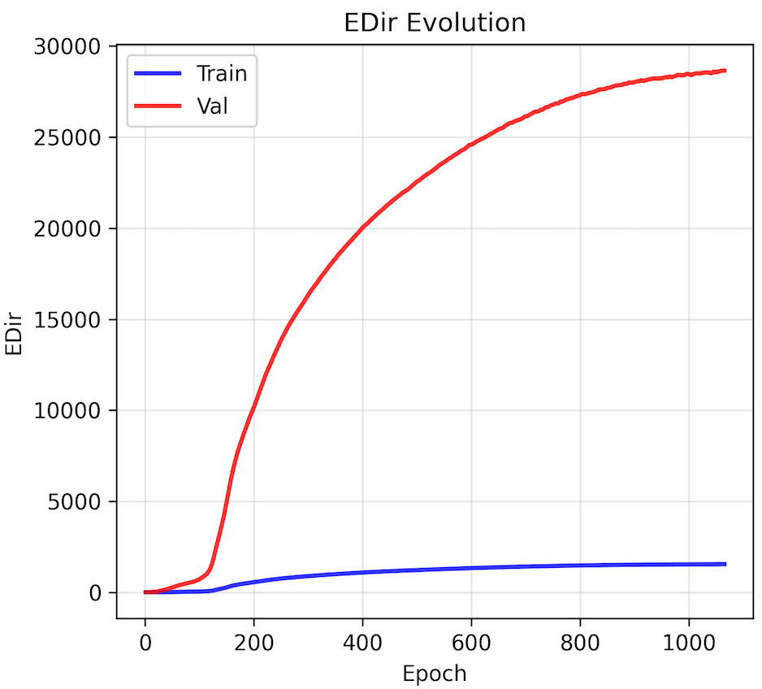
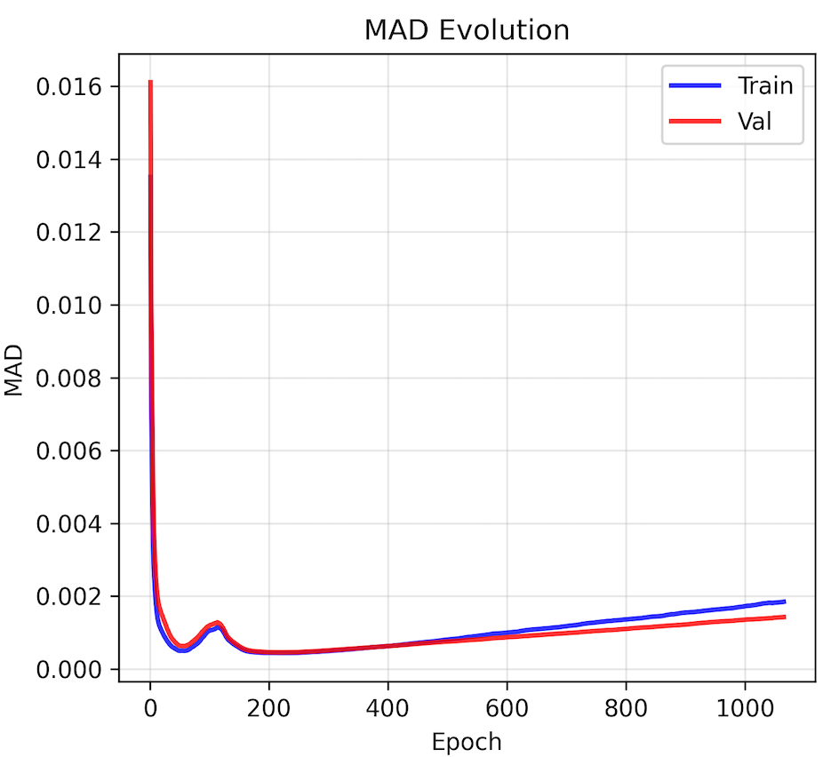
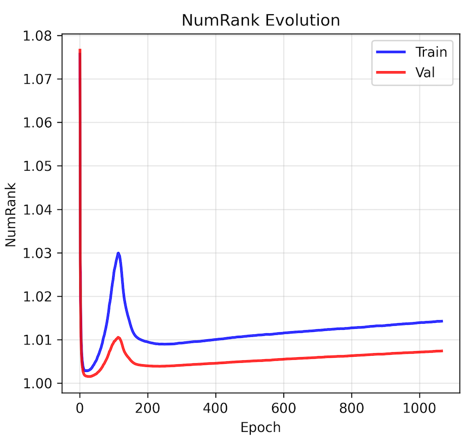

# Benchmarking Robustness Strategies for Graph Neural Networks under Noise

This study contributes to the analysis of the robustness of Graph Neural Networks by developing a benchmarking framework that systematically evaluates methods designed to address graph noise, including label, structural, and feature noise. The framework reproduces selected robustness strategies under standardized conditions across commonly used datasets, enabling fair and reproducible comparisons. Although numerous robustness approaches have been proposed for GNNs, their evaluations are often inconsistent. This work analyzes the performance of existing robustness strategies under uniform experimental setups and across different types of graph noise, with the goal of identifying the methods that generalize most effectively. Several strategies have been introduced in the literature, including noise-resistant training, structure-learning techniques, and specialized frameworks. However, no standard benchmarking framework currently exists to directly compare these methods under consistent protocols.

This work therefore establishes a unified benchmarking effort to identify which strategies perform best under controlled and comparable conditions. To this end, extensive experiments and advanced ablation studies are conducted to evaluate not only standard performance metrics but also oversmoothing measures and alternative experimental setups. Furthermore, the study investigates how different backbone architectures influence model performance. By providing a systematic and in-depth analysis under consistent conditions, this study sheds light on the differences among robustness frameworks and highlights which approaches are most effective in various scenarios.

<div style="display: flex; justify-content: center; gap: 10px; margin-bottom: 20px;">
  
</div>

# Experiments

It is possible to observe here some of the experiments conducted during the work.

The following figures present the results on the Cora dataset under a uniform setup, with different noise levels. Two types of noise are considered: **Uniform** and **Instance**.

<p align="center">
  
  
</p>

<i>Results on the Cora dataset with (left) Uniform noise and (right) Instance noise.</i>

In addition, the following plots show the behavior of the **MAD**, **$E^{dir}$**, and **Numrank** oversmoothing metrics of the GCOD framework during training and validation.  
These metrics are employed in the ablation study to better understand the model’s behavior beyond the commonly used evaluation measures.

<p align="center">
  
  
  
</p>

<i>Evolution of E<sup>dir</sup> (left), MAD (center), and NumRank (right) metrics during training and validation.</i>

# Configuration

## General
- **seed**: Random seed used to initialize model weights and ensure reproducibility of experiments.
- **device**: Specifies the hardware for training (`cpu` or `cuda`).

## Dataset
- **name**: The name of the dataset to be used (`cora`, `citeseer`, `pubmed`).
- **root**: Path where the dataset is stored or will be downloaded.

## Noise
- **type**: Type of label noise injected into the dataset (`clean`, `uniform`, `uniform_simple`, `random`, `pair`, `random_pair`, `flip`, `uniform_mix`, `instance`, `deterministic`).
- **rate**: Proportion of nodes affected by noise.
- **seed**: Random seed used specifically for noise generation.

## Model
- **name**: Backbone architecture (`gcn`, `gin`, `gat`, `gatv2`).
- **hidden_channels**: Size of hidden representations in each layer.
- **n_layers**: Number of layers in the model.
- **dropout**: Dropout probability to prevent overfitting.
- **self_loop**: Whether to add self-loops to nodes in the graph.
- **mlp_layers**: Number of layers in an MLP applied on node features.
- **train_eps**: Whether the epsilon parameter in GIN is trainable.
- **heads**: Number of attention heads for GAT or GATv2.

## Training
- **method**: Training method (`standard`, `positive_eigenvalues`, `gcod`, `nrgnn`, `pi_gnn`, `cr_gnn`, `community_defense`, `rtgnn`, `graphcleaner`, `unionnet`, `gnn_cleaner`, `erase`, `gnnguard`).
- **lr**: Learning rate for the optimizer.
- **weight_decay**: L2 regularization weight to avoid overfitting.
- **epochs**: Maximum number of training epochs.
- **patience**: Number of epochs without improvement before early stopping.

## Framework-Specific Parameters

### Standard Training
- **standard_params**: Empty; uses default training.

### Positive Eigenvalues
- **batch_size**: Number of model weight matrices updated before applying the positive singular value (eigenvalue) constraint.

### GCOD
- **batch_size**: Number of nodes processed at a time when computing the GCOD loss.
- **uncertainty_lr**: Learning rate controlling how fast uncertainty parameters are updated during GCOD loss computation.

### NRGNN
- **edge_hidden**: Dimension of hidden representations in the edge predictor.
- **n_p**: Maximum number of potential edges per node added from the most similar nodes.
- **p_u**: Confidence threshold to select unlabeled nodes for model updates.
- **alpha**: Weight of edge reconstruction loss in the total loss.
- **beta**: Weight of consistency loss aligning the main model with the predictor on confident nodes.
- **t_small**: Threshold above which nodes are considered connected by the edge predictor.
- **n_n**: Number of negative samples used to balance edge reconstruction.

### PI-GNN
- **start_epoch**: Epoch at which joint training with the main model begins.
- **miself**: Whether to use self mutual information in contextual loss computation.
- **norm**: Normalization factor applied in loss computation.
- **vanilla**: Whether to apply contextual regularization based on PI model predictions.

### CR-GNN
- **T**: Temperature for constructing similarity matrices in embedding and prediction spaces.
- **tau**: Temperature for contrastive loss; affects separation of positive and negative pairs.
- **p**: Filtering threshold for low similarity values in prediction space.
- **alpha**: Weight of contrastive loss.
- **beta**: Weight for cross-space consistency between embedding and prediction spaces.
- **pr**: Probability of dropout/masking

### Community Defense
- **community_method**: Algorithm used for community detection (`louvain`, `spectral`).
- **num_communities**: Number of communities; automatically detected if null.
- **lambda_comm**: Weight for the community-preserving auxiliary task.
- **pos_weight**: Weight for positive node pairs within the same community.
- **neg_weight**: Weight for negative node pairs from different communities.
- **margin**: Minimum embedding distance between negative pairs.
- **num_neg_samples**: Number of negative samples per node.

### RTGNN
- **edge_hidden**: Dimension of hidden representations in the edge predictor.
- **co_lambda**: Weight for co-teaching regularization; balances intra-view regularization.
- **alpha**: Weight assigned to the reconstruction loss; preserves graph structure.
- **th**: Confidence threshold for creating pseudo labels.
- **K**: Number of nearest-neighbor candidates to consider for additional edges.
- **tau**: Minimum similarity threshold for filtering unreliable edges.
- **n_neg**: Number of negative samples generated per node for reconstruction loss.

### GraphCleaner
- **k**: Number of neighborhood propagation hops in the mislabel detector.
- **sample_rate**: Fraction of nodes used for synthetic mislabel generation.
- **max_iter_classifier**: Maximum number of iterations to train the binary classifier.
- **held_split**: Split used to estimate the noise transition matrix.

### UnionNET
- **k**: Number of most similar neighbors used to construct the support set for label propagation.
- **alpha**: Weight balancing the reweighted loss and the correction loss.
- **beta**: Weight for the KL-divergence regularization term.
- **feat_norm**: Whether to normalize node features so that each node's feature vector sums to one.

### GNN Cleaner
- **label_propagation_iterations**: Number of label propagation iterations to correct noisy labels.
- **similarity_epsilon**: Small constant added to similarity computation to prevent division by zero.

### ERASE
- **n_embedding**: Dimensionality of latent representations generated by the encoder.
- **n_heads**: Number of attention heads in the first GAT layer.
- **use_layer_norm**: Whether to apply layer normalization.
- **use_residual**: Whether to add residual connections between input and output.
- **use_residual_linear**: Whether to linearly project residual connections to match dimensions.
- **gam1**: Coefficient in the coding rate controlling compression and discrimination.
- **gam2**: Coefficient in the coding rate controlling compression and discrimination.
- **eps**: Small constant added to stabilize covariance computation.
- **alpha**: Coefficient for label propagation; influence of neighbors’ labels.
- **beta**: Weight combining pseudo-labels with denoised labels.
- **T**: Propagation depth; number of steps labels are propagated.

### GNNGuard
- **P0**: Edge-pruning threshold.
- **K**: Number of GNN layers.
- **D2**: Embedding dimension in the hidden layer.
- **attention**: Whether to use attention mechanism on edges to weight neighbors differently.


## How to run the code

This repository allows you to run experiments in three different modes:
1. **Single experiment run** – execute a single experiment.
2. **Automatic benchmarking of 5 runs** – evaluate performance across multiple runs.
3. **Multithreading options of single run** – test multiple methods in parallel using the same seed.

Before running any experiment:

1. Install the required packages:

```bash
pip install -r requirements.txt
```

2. Set the desired parameters and hyperparameters in the **`config.yaml`** file

### Single experiment run

```python
# Necessary imports
import yaml
from utilities import initialize_experiment
from model.GCOD_loss import GCODTrainer

# Load the configuration file
with open("config.yaml", "r") as f:
    config = yaml.safe_load(f)

# Initialize parameters for the experiment
init_data = initialize_experiment(config, run_id=1)

device = init_data['device']
data_for_training = init_data['data_for_training']
backbone_model = init_data['backbone_model']
global_noisy_indices = init_data['global_noisy_indices']
lr = init_data['lr']
weight_decay = init_data['weight_decay']
epochs = init_data['epochs']
patience = init_data['patience']

# Set specific parameters for GCOD
gcod_params = config.get('gcod_params', {})
batch_size = int(gcod_params.get('batch_size', 32))
uncertainty_lr = float(gcod_params.get('uncertainty_lr', 1.0))

# Create the GCOD trainer
trainer = GCODTrainer(
    model=backbone_model,
    data=data_for_training,
    noisy_indices=global_noisy_indices,
    device=device,
    learning_rate=lr,
    weight_decay=weight_decay,
    uncertainty_lr=uncertainty_lr,
    total_epochs=epochs,
    patience=patience,
    batch_size=batch_size,
    debug=True
)

# Run the training
result = trainer.train_full_model()

# Print the results
print("Single run results:")
print(f"Accuracy: {result['accuracy']:.4f}")
print(f"F1 Score: {result['f1']:.4f}")
print(f"Precision: {result['precision']:.4f}")
print(f"Recall: {result['recall']:.4f}")
oversmoothing_results = result['oversmoothing']
print("Oversmoothing metrics:")
print(f"NumRank: {oversmoothing_results['NumRank']:.4f}")
print(f"Erank: {oversmoothing_results['Erank']:.4f}")
print(f"EDir: {oversmoothing_results['EDir']:.4f}")
print(f"EDir_trad: {oversmoothing_results['EDir_traditional']:.4e}")
print(f"EProj: {oversmoothing_results['EProj']:.4f}")
print(f"MAD: {oversmoothing_results['MAD']:.4f}")
```

### Automatic benchmarking of 5 runs

Run the main script:
```bash
python main.py
```

### Multithreading options for single run (Thread pooling)

Run the multithreading main using command-line arguments:
```bash
# Use default methods (standard, cr_gnn, nrgnn)
python main_multithreading.py

# Specify custom methods
python main_multithreading.py --methods standard positive_eigenvalues gcod nrgnn

# Short version
python main_multithreading.py -m standard positive_eigenvalues gcod nrgnn

# Use different run ID for different seed
python main_multithreading.py -m standard gcod --run-id 5

# Get help
python main_multithreading.py --help
```
**Limitations:** Maximum 4 methods can be tested simultaneously. Parallel workers: GPU max 2 and CPU max 4 (workers are automatically adjusted based on available resources).

## How to add frameworks

The models are implemented in the `model` directory, with each model in its corresponding file. The main file (`main.py`) imports the `run_experiment` function from `utilities.py`, which in turn imports the models specified in `config.yaml` and sets up everything necessary for benchmarking.

It is possible to add new frameworks simply by adding their code as a new file in the `model` directory and updating the `run_experiment` utility function (if you want to use the automatic main script or the multithreading main script) to also include the new frameworks.

## Structure
```
.
├── config.yaml
├── images
│   ├── Asymmetric.png
│   ├── diagram.png
│   ├── E_dir.png
│   ├── Mad.png
│   ├── NumRank.png
│   └── Symmetric.png
├── LICENSE
├── main.py
├── model
│   ├── Standard.py
│   ├── CommunityDefense.py
│   ├── CR_GNN.py
│   ├── ERASE.py
│   ├── evaluation.py
│   ├── GCOD_loss.py
│   ├── GNN_Cleaner.py
│   ├── GNNGuard.py
│   ├── GNNs.py
│   ├── GraphCleaner.py
│   ├── NRGNN.py
│   ├── PI_GNN.py
│   ├── Positive_Eigenvalues.py
│   ├── RTGNN.py
│   └── UnionNET.py
├── README.md
├── requirements.txt
└── utilities.py
```

## Author
Michael Corelli